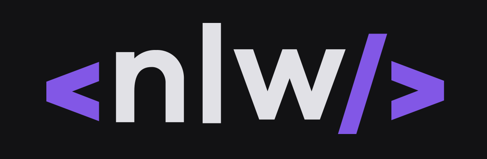
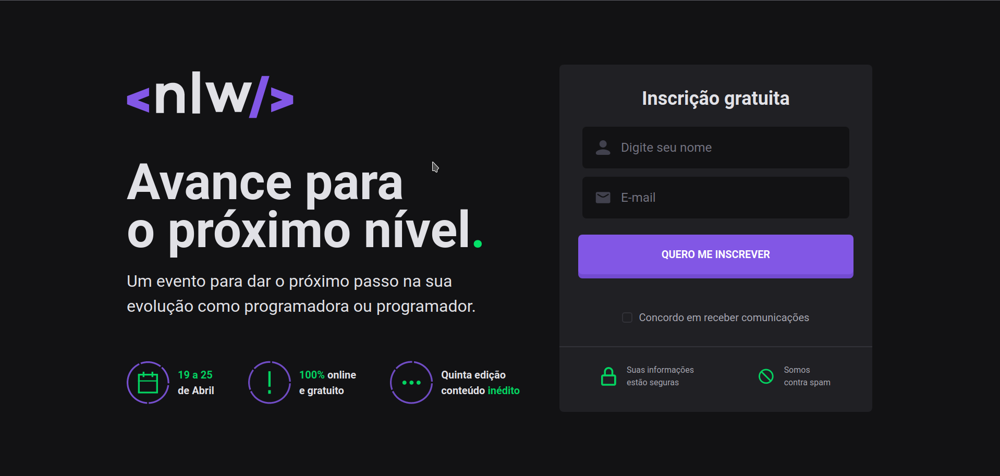
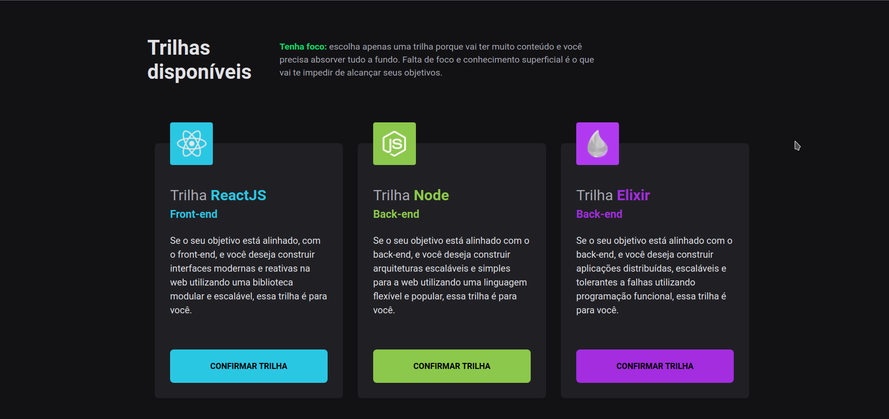
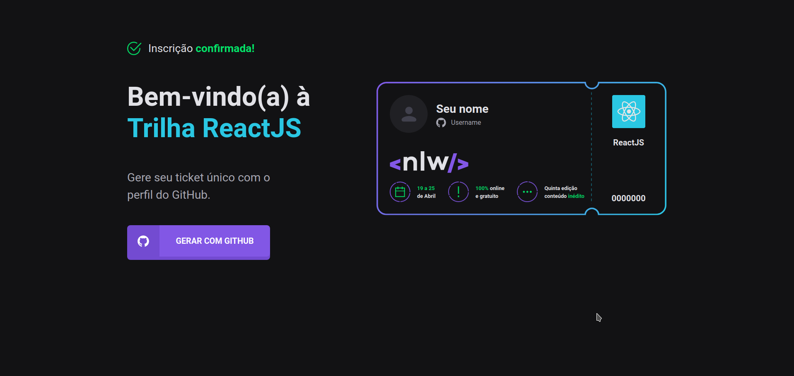
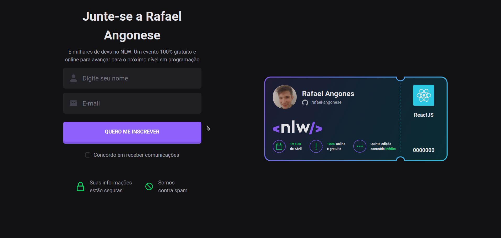

<div align="center">
  
</div>

---

## 👁️‍🗨️ **Preview**







---

## 📄 **Descrição**

Um evento para dar o próximo passo na sua evolução como programadora ou programador.

---

## 🧪 **Tecnologias**

Esse projeto foi desenvolvido com as seguintes tecnologias:

- [Next.js](https://nextjs.org/)
- [TypeScript](https://www.typescriptlang.org/)
- [ChakraUI](http://chakra-ui.com/getting-started)
- [Firebase](https://firebase.google.com/)
- [Formik](https://formik.org/)
- [Yup](https://github.com/jquense/yup)

---

## 🎮 **Ambiente de desenvolvimento**

```bash
node --version
v16.0.0
```

---

## **🚀 Como executar**

```bash
# Clone este repositório.
$ git clone git@github.com:rafael-angonese/next-level-week-clone.git

# Vá para a pasta next-level-week-clone
$ cd next-level-week-clone

# Instale as dependências
$ npm install

# Execute a aplicação
$ npm run dev
```

- O app estará rodando na porta 3000 no seu browser.
- Acesse [`<http://localhost:3000>`](http://localhost:3000)

---

## ⚖️ **Licença**

Esse projeto está sob a licença MIT. Veja o arquivo [LICENSE](LICENSE.md) para mais detalhes.

---

Feito com 💜 by Rafael Angonese
